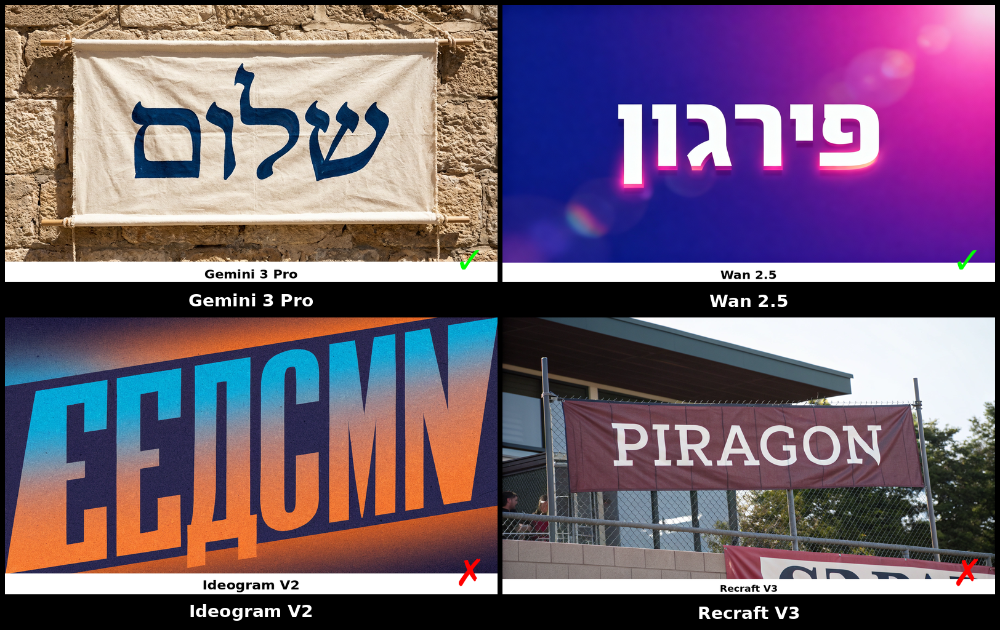
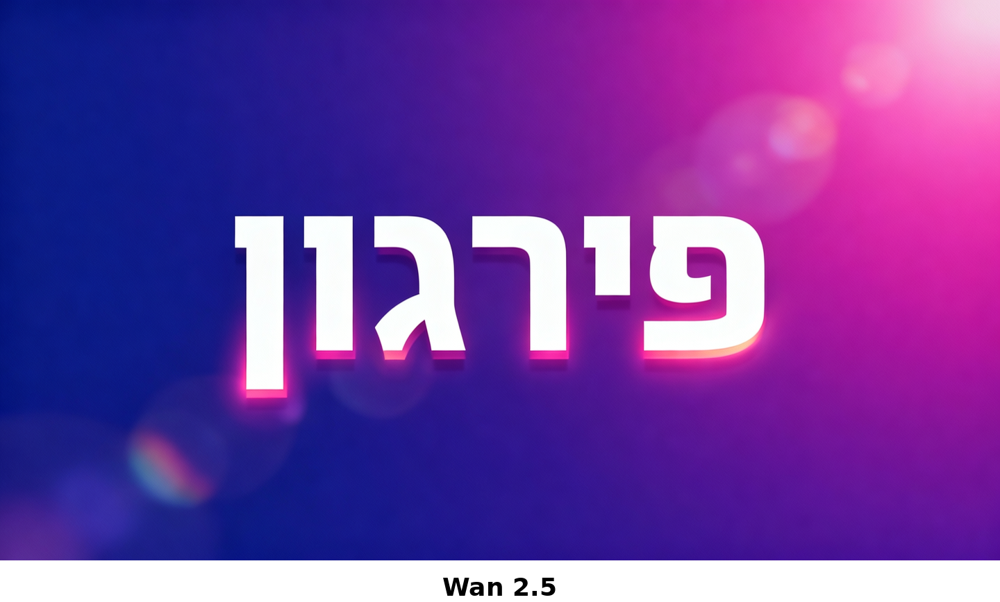

# Hebrew Image Generation Evaluation



An evaluation of major text-to-image models on their ability to accurately render Hebrew text (prompts: English with request to generate Hebrew word).

## Overview

This evaluation tests 12 image generation models on two Hebrew words:
- **שלום** (Shalom) - The most famous Hebrew word
- **פירגון** (Firgun) - A less common word meaning "joy in sharing others' success"

**Aspect ratio:** 16:9

### Prompts Used

```
A banner graphic with the word שלום written in large font
```

```
A banner graphic with the word פירגון written in large font
```

## Results Summary

| Model | שלום | פירגון | Score |
|-------|:----:|:------:|:-----:|
| **Gemini 3 Pro** | ✓ | ✓ | **2/2** |
| **Nano Banana Pro** | ✓ | ✓ | **2/2** |
| Wan 2.5 | ✗ | ✓ | 1/2 |
| Flux 2 | ✗ | ✗ | 0/2 |
| Flux 2 Pro | ✗ | ✗ | 0/2 |
| Flux Dev | ✗ | ✗ | 0/2 |
| Imagen 4 | ✗ | ✗ | 0/2 |
| Ideogram V2 | ✗ | ✗ | 0/2 |
| Qwen Image | ✗ | ✗ | 0/2 |
| SD 3.5 Large | ✗ | ✗ | 0/2 |
| Recraft V3 | ✗ | ✗ | 0/2 |
| Aura Flow | ✗ | ✗ | 0/2 |

## Key Findings

### Winners

1. **Gemini 3 Pro** - Best performer with contextual understanding. Not only rendered Hebrew correctly, but added relevant emojis (thumbs up) for פירגון that complemented the word's meaning.

2. **Nano Banana Pro** - Reliable Hebrew rendering on both tests.

### Common Failure Modes

- **Wrong script:** Models rendered Arabic, Russian, or English instead of Hebrew
- **Pseudotext:** Valid-looking Hebrew characters but nonsensical/wrong words
- **Mixed scripts:** Hebrew letters mixed with Latin or other characters
- **Invalid characters:** Hebrew-like glyphs that don't conform to actual script

### Failed All Tests (9 models)

Flux 2, Flux 2 Pro, Flux Dev, Imagen 4, Ideogram V2, Qwen Image, SD 3.5 Large, Recraft V3, Aura Flow

## Sample Images

### Good Results

**Gemini 3 Pro - שלום (Correct)**


**Gemini 3 Pro - פירגון (Correct + contextual emojis)**


**Nano Banana Pro - שלום (Correct)**


**Wan 2.5 - פירגון (Correct)**



### Bad Results

**Ideogram V2 - שלום (Russian-like text)**


**Flux Dev - שלום (Arabic script)**


**Recraft V3 - פירגון (Rendered "piragoN" - incorrect transliteration rather than Hebrew)**


## Repository Structure

```
├── outputs/              # Series 1 generated images
│   ├── shalom/          # All שלום outputs
│   └── firgun/          # All פירגון outputs
├── outputs-series2/      # Series 2 generated images (Hebrew prompts)
├── samples/              # Curated sample images for README
├── evaluation-results.md # Detailed evaluation notes
├── evaluation-results.json
├── hebrew-eval-report.pdf
├── models.md             # List of models tested
├── prompts.md            # Prompts and evaluation criteria
└── run_eval.py           # Evaluation script
```

## Running the Evaluation

```bash
export FAL_KEY="your-fal-api-key"
python3 run_eval.py
```

## Series 2: Hebrew Prompts

A follow-up test using prompts written entirely in Hebrew to see if prompt language affects rendering accuracy.

### Prompts Used (Series 2)

```
גרפיקה עם המילה שלום בגופן גדול
```

```
גרפיקה עם המילה פירגון בגופן גדול
```

### Results (Series 2)

| Model | שלום | פירגון | Score |
|-------|:----:|:------:|:-----:|
| **Nano Banana Pro** | ✓ | ✓ | **2/2** |
| Wan 2.5 | ✗ | ✓ | 1/2 |
| Flux 2 | ✗ | ✗ | 0/2 |
| Flux Dev | ✗ | ✗ | 0/2 |

### Series 2 Findings

- **Prompt language had no noticeable effect** on results—models that succeeded with English prompts also succeeded with Hebrew prompts, and vice versa.
- **Nano Banana Pro** demonstrated impressive contextual understanding, maintaining reliable Hebrew rendering regardless of prompt language.
- **Wan 2.5** continued its pattern of succeeding on פירגון but failing on שלום.
- **Flux models** failed on both words regardless of prompt language.

## Conclusion

Most image generation models struggle significantly with Hebrew text rendering. Only **Gemini 3 Pro** and **Nano Banana Pro** demonstrated reliable Hebrew typography capabilities on both tests. **Wan 2.5** showed partial success, correctly rendering פירגון but failing on שלום—making it the only non-Google model to successfully render any Hebrew word.

Writing prompts in Hebrew rather than English did not noticeably alter results for better or worse.

For projects requiring Hebrew text in generated images, Gemini 3 Pro and Nano Banana Pro are currently the recommended choices.
