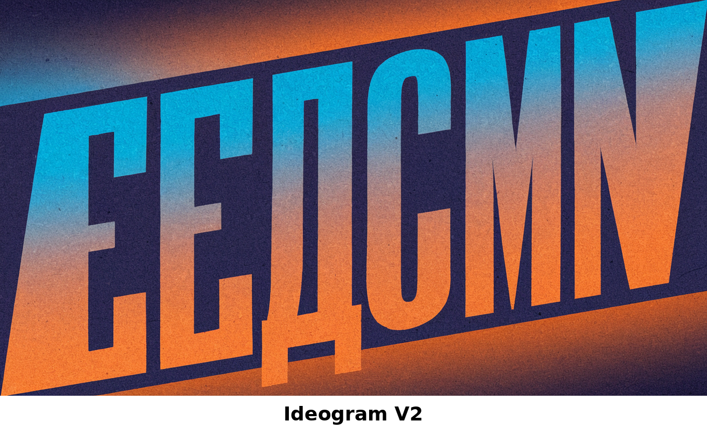
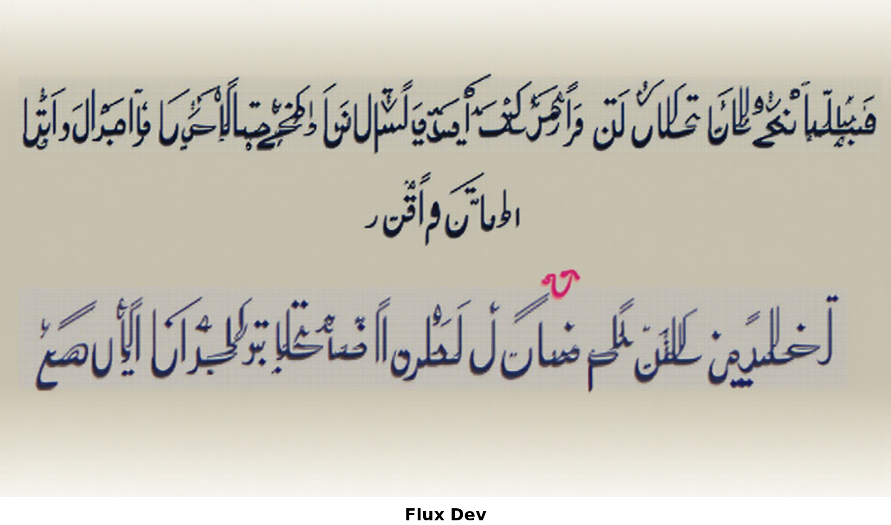

# Hebrew Image Generation Evaluation

An evaluation of major text-to-image models on their ability to accurately render Hebrew text.

## Overview

This evaluation tests 12 image generation models on two Hebrew words:
- **שלום** (Shalom) - The most famous Hebrew word
- **פירגון** (Firgun) - A less common word meaning "joy in sharing others' success"

**Prompt template:** "A banner graphic with the word [word] written in large font"
**Aspect ratio:** 16:9

## Results Summary

| Model | שלום | פירגון | Score |
|-------|:----:|:------:|:-----:|
| **Gemini 3 Pro** | ✓ | ✓ | **2/2** |
| **Nano Banana Pro** | ✓ | ✓ | **2/2** |
| Wan 2.5 | ✗ | ✓ | 1/2 |
| Flux 2 | ✗ | ✗ | 0/2 |
| Flux 2 Pro | ✗ | ✗ | 0/2 |
| Flux Dev | ✗ | ✗ | 0/2 |
| Imagen 4 | ✗ | ✗ | 0/2 |
| Ideogram V2 | ✗ | ✗ | 0/2 |
| Qwen Image | ✗ | ✗ | 0/2 |
| SD 3.5 Large | ✗ | ✗ | 0/2 |
| Recraft V3 | ✗ | ✗ | 0/2 |
| Aura Flow | ✗ | ✗ | 0/2 |

## Key Findings

### Winners

1. **Gemini 3 Pro** - Best performer with contextual understanding. Not only rendered Hebrew correctly, but added relevant emojis (thumbs up) for פירגון that complemented the word's meaning.

2. **Nano Banana Pro** - Reliable Hebrew rendering on both tests.

### Common Failure Modes

- **Wrong script:** Models rendered Arabic, Russian, or English instead of Hebrew
- **Pseudotext:** Valid-looking Hebrew characters but nonsensical/wrong words
- **Mixed scripts:** Hebrew letters mixed with Latin or other characters
- **Invalid characters:** Hebrew-like glyphs that don't conform to actual script

### Failed All Tests (9 models)

Flux 2, Flux 2 Pro, Flux Dev, Imagen 4, Ideogram V2, Qwen Image, SD 3.5 Large, Recraft V3, Aura Flow

## Sample Images

### Good Results

**Gemini 3 Pro - שלום (Correct)**


**Gemini 3 Pro - פירגון (Correct + contextual emojis)**


**Nano Banana Pro - שלום (Correct)**


### Bad Results

**Ideogram V2 - שלום (Russian-like text)**



**Flux Dev - שלום (Arabic script)**



**Recraft V3 - פירגון (Random English word)**


## Files

- `evaluation-results.md` - Detailed evaluation notes
- `evaluation-results.json` - Results in JSON format
- `hebrew-eval-report.pdf` - Full PDF report with all images
- `outputs/shalom/` - All generated images for שלום
- `outputs/firgun/` - All generated images for פירגון
- `run_eval.py` - Script to run the evaluation

## Running the Evaluation

```bash
export FAL_KEY="your-fal-api-key"
python3 run_eval.py
```

## Conclusion

Most image generation models struggle significantly with Hebrew text rendering. Only **Gemini 3 Pro** and **Nano Banana Pro** demonstrated reliable Hebrew typography capabilities. For projects requiring Hebrew text in generated images, these two models are currently the recommended choices.
